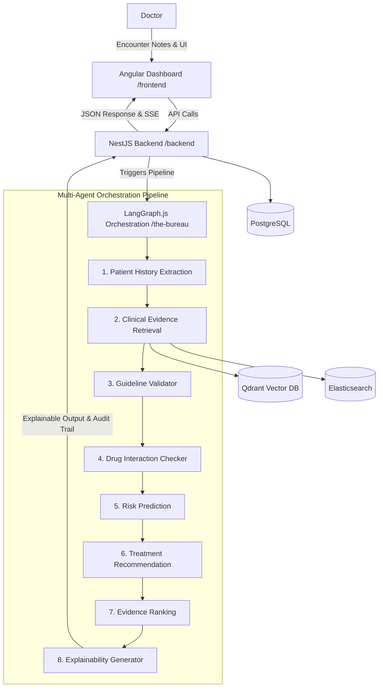

# Mediscribe: The Bureau

Mediscribe is a comprehensive, multi-agent AI clinical decision-support ecosystem. The repository is organized as a monorepo containing the landing page, the doctor's dashboard, the backend services, and the multi-agent orchestration pipeline.

## System Architecture



---

## Directory Structure

*   **[`/landing`](file:///d:/the-bureau/landing)**: Public-facing Angular application showcasing Mediscribe's features, capability overview, and product information.
*   **[`/frontend`](file:///d:/the-bureau/frontend)**: Fully-featured Angular dashboard used by doctors to create patient encounter notes, view analysis histories, and receive real-time clinical recommendations.
*   **[`/backend`](file:///d:/the-bureau/backend)**: NestJS server-side application providing API endpoints, database persistence (Postgres via Prisma), data indexing, and pipeline invocation.
*   **[`/the-bureau`](file:///d:/the-bureau/the-bureau)**: LangGraph.js orchestration service implementing the 8-agent clinical decision-support workflow.
*   **[`docker-compose.yml`](file:///d:/the-bureau/docker-compose.yml)**: Multi-container configuration to spin up the local backing data stores (PostgreSQL, Qdrant Vector DB, Elasticsearch).

---

## Getting Started

### Prerequisites

*   [Node.js](https://nodejs.org/) (v18+ recommended)
*   [Docker & Docker Compose](https://www.docker.com/)

### 1. Run Supporting Databases
Spin up PostgreSQL, Qdrant, and Elasticsearch via Docker:
```bash
docker compose up -d
```

### 2. Configure Environment Variables
Copy the `.env.example` templates to `.env` in the following directories and fill in your API keys (e.g., Anthropic, NVIDIA LLM keys):
*   `/backend`
*   `/the-bureau`

### 3. Install & Start Services

#### Backend & LangGraph Orchestrator
```bash
# In /backend
npm install
npx prisma db push
npm run start:dev

# In /the-bureau
npm install
npm run dev
```

#### Frontend & Landing Page
```bash
# In /frontend
npm install
ng serve

# In /landing
npm install
ng serve
```

---

## 8-Agent Clinical Pipeline Details

The orchestrator service (`/the-bureau`) wires up a linear pipeline:
1.  **Patient History Extraction**: Clinical NER to pull patient conditions and drug history.
2.  **Clinical Evidence Retrieval**: Searches Qdrant & Elasticsearch for relevant studies.
3.  **Guideline Validator**: Cross-references against established medical guidelines.
4.  **Drug Interaction Checker**: Screens proposed treatments against the patient's active drug list.
5.  **Risk Prediction**: Analyzes cardiovascular, renal, or custom risk scoring.
6.  **Treatment Recommendation**: Formulates potential therapeutic options.
7.  **Evidence Ranking**: Grades the recommendations based on citation quality.
8.  **Explainability Generator**: Translates complex analysis into clear reasoning for the provider.
